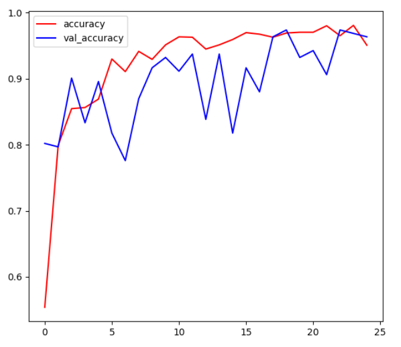
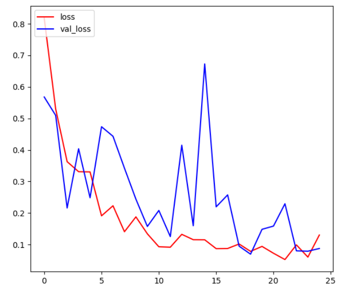

# Smart-Agriculture-Potato-Disease-Detection-using-AI-Models
The system leverages Convolutional Neural Networks (CNNs) trained on labeled potato leaf datasets to provide accurate predictions. The goal is to assist farmers and researchers in early disease detection, helping to reduce crop losses and improve agricultural productivity.

---

````markdown
# Potato Plant Disease Detection using CNN

## Project Overview
This project is a **Convolutional Neural Network (CNN)-based image classification model** for detecting diseases in potato plant leaves.  
The model can classify an uploaded leaf image into one of the following categories:  

- **Potato___Healthy**  
- **Potato___Early_Blight**  
- **Potato___Late_Blight**

The system helps in **early disease detection** and supports farmers and agricultural researchers in improving crop yield and reducing losses.

---

## Model Architecture (Conv2D Neural Network)
The model is built using **TensorFlow/Keras** with multiple **Conv2D** and **MaxPooling layers** to extract features from potato leaf images.

**Model Summary:**
- **Input Layer** → Resized leaf images (256x256)  
- **Convolutional Layers (Conv2D)** → Detect low-level (edges, textures) and high-level (disease spots) features  
- **Pooling Layers (MaxPooling2D)** → Reduce dimensionality while preserving important features  
- **Dropout Layers** → Prevent overfitting  
- **Fully Connected (Dense) Layers** → Classify extracted features into categories  
- **Output Layer** → Softmax activation for 3 classes  

**Sample Architecture Code:**
```python
from tensorflow.keras.models import Sequential
from tensorflow.keras.layers import Conv2D, MaxPooling2D, Flatten, Dense, Dropout

model = models.Sequential([
    layers.Input(shape=input_shape),
    resize_and_rescale,
    data_augmentation,
    layers.Conv2D(filters=32, kernel_size=(3,3), activation='relu'),
    layers.MaxPooling2D((2,2)),
    layers.Conv2D(filters=64, kernel_size=(3,3), activation='relu'),
    layers.MaxPooling2D((2,2)),
    layers.Conv2D(filters=64, kernel_size=(3,3), activation='relu'),
    layers.MaxPooling2D((2,2)),
    layers.Conv2D(filters=64, kernel_size=(3,3), activation='relu'),
    layers.MaxPooling2D((2,2)),
    layers.Conv2D(filters=64, kernel_size=(3,3), activation='relu'),
    layers.MaxPooling2D((2,2)),
    layers.Flatten(),
    layers.Dense(64, activation='relu'),
    layers.Dense(n_classes, activation='softmax')
])
````

---

## 📊 Training Performance

The model was trained with **categorical cross-entropy loss** and **Adam optimizer**.

* **Training Accuracy:** \~ *96.37%*
* **Validation Accuracy:** \~ *96.35%*

### 📈 Accuracy Graph



### 📉 Loss Graph




---

## 🚀 How to Use

1. Clone this repository

   ```bash
   git clone https://github.com/your-username/potato-disease-detection.git
   cd potato-disease-detection
   ```
2. Install dependencies

   ```bash
   pip install -r requirements.txt
   ```
3. Run training

   ```bash
   python train.py
   ```
4. For predictions (example with Streamlit app):

   ```bash
   streamlit run app.py
   ```

---

## 🛠️ Tech Stack

* Python
* TensorFlow / Keras
* OpenCV
* NumPy, Pandas, Matplotlib
* Streamlit (for web deployment)

---

## 📌 Future Enhancements

* Extend model to detect more crop diseases
* Deploy as a mobile/web application for farmers
* Integrate with IoT-based crop monitoring systems

---


